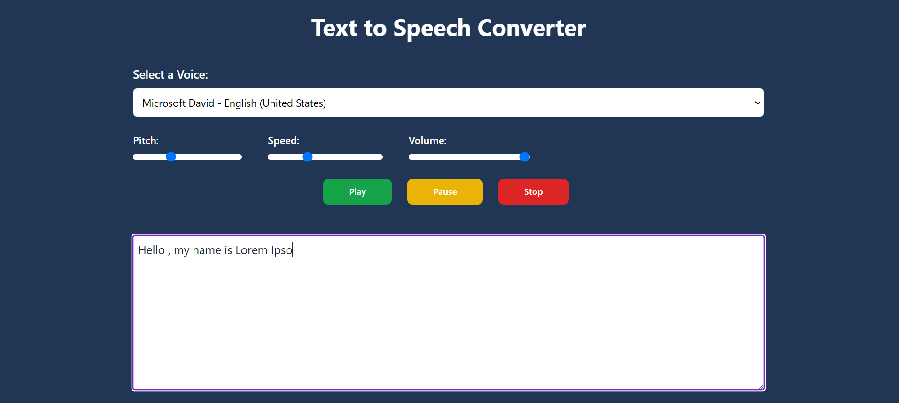

# Text-to-Speech Converter

A simple and efficient Text-to-Speech (TTS) converter built using JavaScript, Vite, JSX, Tailwind CSS, and HTML. This project allows you to convert text into natural-sounding speech directly in the browser, offering a user-friendly interface and customizable options like rate, pitch, and volume.



## Features:
- Converts input text into high-quality, natural-sounding speech.
- Supports multiple voices and languages (depending on browser support).
- Customizable speech rate, pitch, and volume.
- Simple and user-friendly interface.

## Prerequisites:
- Node.js installed (for running the development server).
- A browser that supports the Web Speech API (most modern browsers).

## Steps to Run the Project

### 1. Clone the Repository
Clone the repository to your local machine using Git:
```bash
git clone https://github.com/itspiyush3451/Text-to-Speech.git
```

### 2. Make sure you have npm installed. You can install the latest version of npm globally using the following command:
```bash
npm install npm@latest -g
```

### 3. Install NPM Packages
Navigate into the project directory and install the required dependencies:
```bash
cd Text-to-Speech
npm install
```

### 4. Run the Application using Vite
Start the development server to view the project locally:
```bash
npm run dev
```
This will launch the project in your default web browser, typically at `http://localhost:3000` , but it may vary .

## How to Use:
- Enter the text you want to convert into speech in the text area.
- Adjust the speech rate, pitch, and volume using the available sliders.
- Press the "Speak" button to hear the text being read out loud.
- Choose a voice from the available options if your browser supports it.

## Customizing the Project:
- Modify the `src/App.jsx` file to customize the functionality or appearance.
- Use Tailwind CSS classes to easily style the elements.
- You can adjust the Web Speech API settings to change voice, rate, pitch, and volume to better suit your needs.

## Contributing:
Feel free to open issues or submit pull requests to improve this project. Contributions are always welcome!
